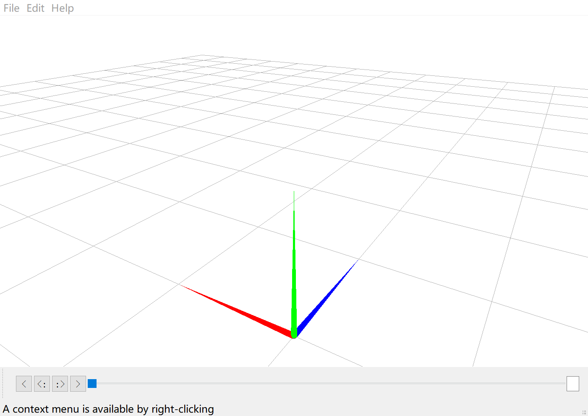

# 安装

首先需要安装以下包:
```bash
pip install numpy scipy pyopengl pyqt5 
```

然后在本文件夹内运行
```bash
pip install -e .
```


# 可视化

命令行内运行

```bash
python .\pymotionlib\editor\Main.py # 需要在本文件夹运行
python -m pymotionlib.editor # 任意文件夹运行
```

可视化界面:



一些常用快捷键

- Ctrl+O: 打开
- Alt+O: 将文件resample到60FPS并打开
- Ctrl+R: 清空Viewer
- Ctrl+I: 显示动作颜色与名字的对应关系

# 数据处理

`test.py`展示了一个例子，其中展示了一部分你需要的功能。其余功能可以通过阅读`pymotionlib\MotionData.py`和`pymotionlib\BVHLoader.py`了解（强烈建议阅读源码）